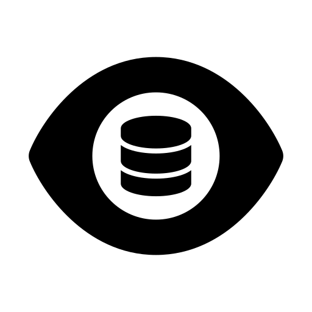
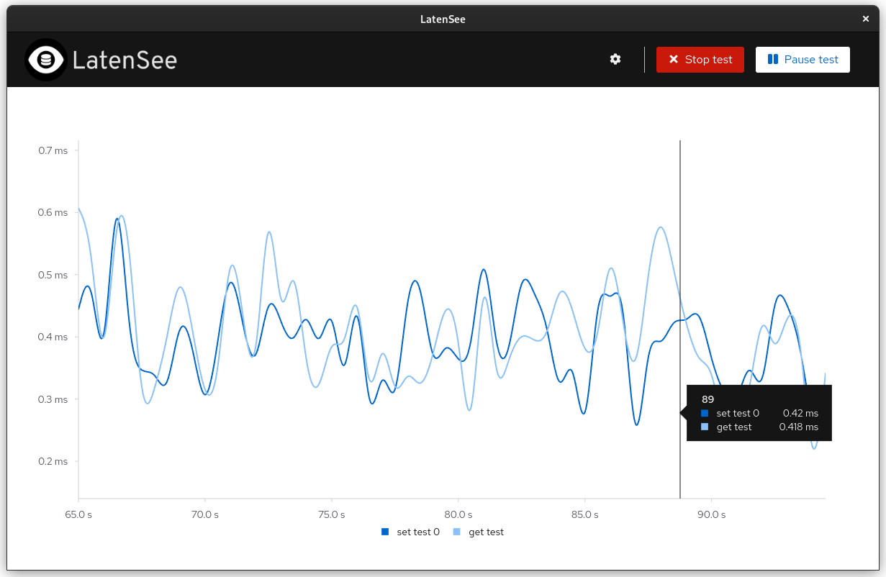
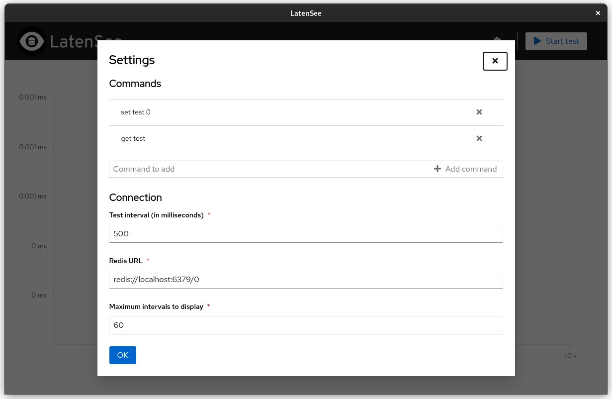

# LatenSee

Redis/Valkey latency visualizer.

 

  

## Overview

LatenSee is A Redis/Valkey latency visualization tool.

It enables you to:

- **Visualize latency in real-time**: By providing a [hydrapp](https://github.com/pojntfx/hydrapp/)-based UI, it is able give insights into your Redis/Valkey server's latency as the test is running.
- **Monitor jitter and latency over a long period of time**: By giving you the option of pausing and resuming tests and providing various configuration options, LatenSee can be used to gather detailed long-term metrics.
- **Analyze test results with external tools**: Thanks to its integrated CSV export feature, it's easy to export measurement results and analyze them using your preferred tooling, too.

## Installation

See [INSTALLATION.html](https://loopholelabs.github.io/latensee//docs/main/INSTALLATION.html).

## Reference

### Settings

You can open the settings through the settings button in the top right; here you can configure many aspects of the application such as the Redis/Valkey URL and the maximum intervals to display:

### Command Line Arguments

All arguments passed to the binary will be forwarded to the browser used to display the frontend.

### Environment Variables

| Name                     | Description                                                                                                 |
| ------------------------ | ----------------------------------------------------------------------------------------------------------- |
| `HYDRAPP_BACKEND_LADDR`  | Listen address for the backend (`localhost:0` by default)                                                   |
| `HYDRAPP_FRONTEND_LADDR` | Listen address for the frontend (`localhost:0` by default)                                                  |
| `HYDRAPP_BROWSER`        | Binary of browser to display the frontend with                                                              |
| `HYDRAPP_TYPE`           | Type of browser to display the frontend with (one of `chromium`, `firefox`, `epiphany`, `lynx` and `dummy`) |
| `HYDRAPP_SELFUPDATE`     | Whether to check for updates on launch (disabled if OS provides an app update mechanism)                    |

## Acknowledgements

- [pojntfx/hydrapp](https://github.com/pojntfx/hydrapp) provides the application framework.
- [Font Awesome](https://fontawesome.com/) provides the assets used for the icon and logo.
- [go-redis/redis](https://github.com/redis/go-redis) provides the Redis/Valkey client.

## Contributing

Bug reports and pull requests are welcome on GitHub at [https://github.com/loopholelabs/latensee][gitrepo]. For more contribution information check out [the contribution guide](./CONTRIBUTING.md).

## License

The LatenSee project is available as open source under the terms of the [Apache License, Version 2.0](http://www.apache.org/licenses/LICENSE-2.0).

## Code of Conduct

Everyone interacting in the LatenSee project's codebases, issue trackers, chat rooms and mailing lists is expected to follow the [CNCF Code of Conduct](https://github.com/cncf/foundation/blob/main/code-of-conduct.md).

## Project Managed By:

[![https://loopholelabs.io][loopholelabs]](https://loopholelabs.io)

[gitrepo]: https://github.com/loopholelabs/latensee
[loopholelabs]: https://cdn.loopholelabs.io/loopholelabs/LoopholeLabsLogo.svg
[loophomepage]: https://loopholelabs.io
